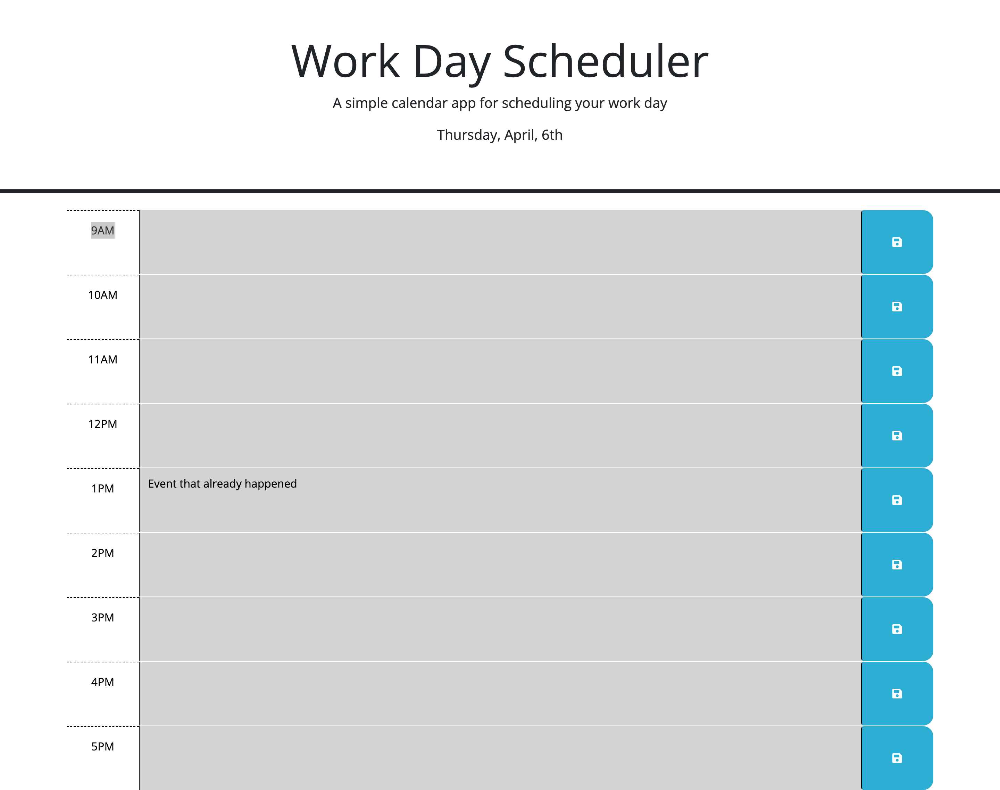

# Work-Day-Scheduler

## Description

The task at hand was to create a simple calendar application that allows a user to save events for each hour of a standard working day (9am-5pm) by modifying starter code. This project was built to showcase skills using Third-Party APIs, specifically using the Day.js library to work with date and time.

## Usage

The following objectives that were completed to fulfill creating a simple calendar application that allows a user to save events for each hour of a standard working day are as follows...

- Ensured that the current date is displayed at the top of the calendar in the header section
- Displayed timeblocks for the standard business hours (9am-5pm)
- Ensured that each timeblock is color coded to display past, present, or future
- Allowed text to be inputted in the time block and saved in local storage
- Display save events after refreshing webpage

## Screenshot

Below is a screenshot of the standard view of the calendar. At the time of the screenshot, it is after normal business hours which displays the time blocks in grey. If the picture was taken between the hours of 9am-5pm, then there would be color coded time blocks in green, red, and grey. Also shown is text in one of the time blocks which is saved to the local storage, even after refreshing when the save button is clicked following an input.

## URL of the Deployed Application

https://matthewzmija.github.io/Work-Day-Scheduler/

## License

MIT License
